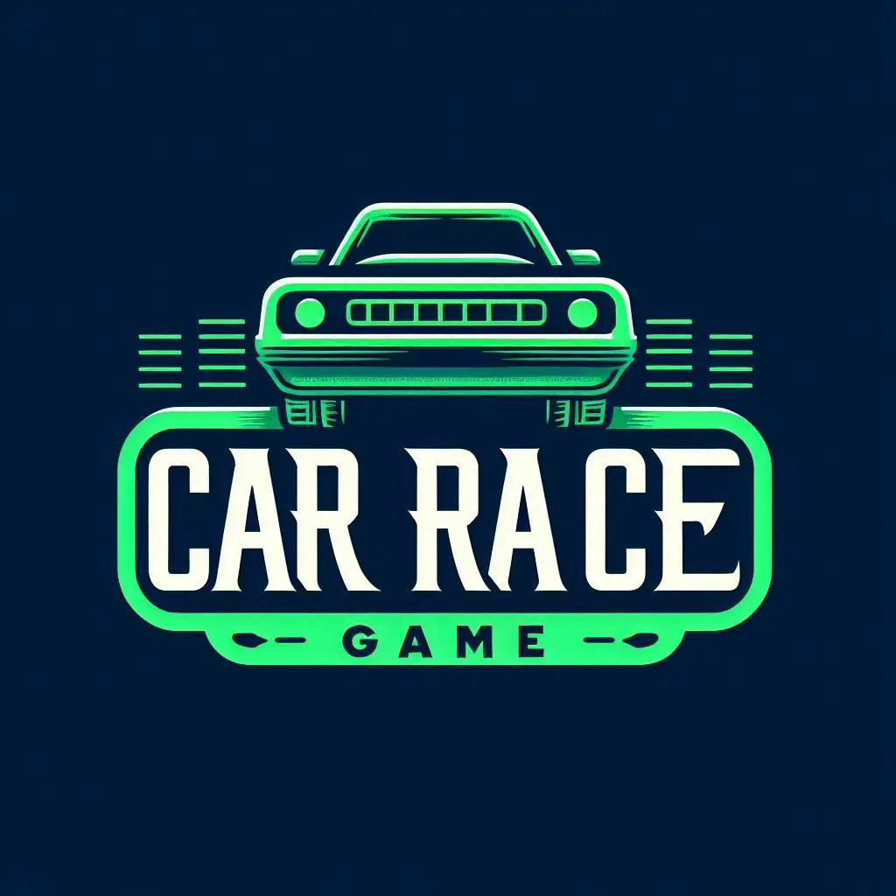

<p align="center">
 
</p>
<p align="center">
    <h1 align="center">CAR RACE GAME</h1>
</p>

<p align="center">
	
	
	
	
<p>
<p align="center">
		<em>Developed with the software and tools below.</em>
</p>
<p align="center">
	
</p>
<hr>

## Quick Links

> - [ Overview](#-overview)
> - [ Features](#-features)
> - [ Repository Structure](#-repository-structure)
> - [ Modules](#-modules)
> - [ Getting Started](#-getting-started)
>   - [ Installation](#-installation)
>   - [ Running 2nd-sem-Final-Project](#-running-2nd-sem-Final-Project)
>   - [ Tests](#-tests)
> - [ Project Roadmap](#-project-roadmap)
> - [ Contributing](#-contributing)
> - [ License](#-license)
> - [ Acknowledgments](#-acknowledgments)

---

## Overview

The Car Race Game is an engaging console-based game where players navigate a car along a road while avoiding collisions with oncoming vehicles. The game features multiple modes, each with varying difficulty levels, and keeps track of the player's score and elapsed time. The game interface includes detailed instructions, a dynamic leaderboard showcasing the top scores, and customizable settings for a personalized gaming experience.

---

## Features

- **Interactive Gameplay**: Control your car using simple keyboard inputs to dodge obstacles and survive as long as possible.
- **Multiple Difficulty Levels**: Choose from different levels, each offering a unique challenge with varying speeds and road conditions.
- **Real-Time Scoring**: Track your score as you progress through the game, with points awarded for distance traveled and successful maneuvers.
- **Leaderboard**: Compete against other players by aiming for the top spots on the leaderboard, which records the highest scores and displays them prominently.
- **Time Tracking**: Monitor the time spent playing, with in-game timers to measure your performance.
- **Customizable Settings**: Adjust game settings such as speed and difficulty to suit your preferences, enhancing the overall gaming experience.
- **Instructions & Tips**: The game provides clear instructions on how to play, along with tips to help players improve their skills.

---

## Repository Structure

```sh
└── 2nd-sem-Final-Project/
    ├── PlayerList.csv
    ├── README.md
    ├── TopThree.csv
    ├── car_race_game.exe
    └── src
        ├── core
        │   ├── enemy.cpp
        │   ├── enemy.h
        │   ├── player.cpp
        │   ├── player.h
        │   ├── screen.cpp
        │   └── screen.h
        ├── global.cpp
        ├── global.h
        ├── main.cpp
        └── utils
            ├── board.cpp
            ├── board.h
            ├── game_logic.cpp
            ├── game_logic.h
            ├── leaderboard_manager.cpp
            ├── leaderboard_manager.h
            ├── timer.cpp
            └── timer.h
```

---

## **Modules**

<details closed><summary>root</summary>

| File                                     | Summary                                                                                                                                               |
| ---------------------------------------- | ----------------------------------------------------------------------------------------------------------------------------------------------------- |
| [PlayerList.csv](./PlayerList.csv)       | This CSV file likely stores a list of player names or details used in the game, possibly including past players or scores.                            |
| [TopThree.csv](./TopThree.csv)           | This CSV file probably stores the top three high scores, including the names of the players and their scores, which are displayed on the leaderboard. |
| [car_race_game.exe](./car_race_game.exe) | The compiled executable file for the car racing game. Running this file will launch the game.                                                         |

</details>
<details closed><summary>src</summary>

| File                           | Summary                                                                                                          |
| ------------------------------ | ---------------------------------------------------------------------------------------------------------------- |
| [main.cpp](./src/main.cpp)     | Contains the entry point of the program. Initializes the game, sets up configurations, and starts the game loop. |
| [global.h](./src/global.h)     | Declares global variables and functions that are accessible throughout the program.                              |
| [global.cpp](./src/global.cpp) | Implements the global variables and utility functions shared across different parts of the game.                 |

</details>

<details closed><summary>src.utils</summary>

| File                                                           | Summary                                                                                                         |
| -------------------------------------------------------------- | --------------------------------------------------------------------------------------------------------------- |
| [leaderboard_manager.cpp](./src/utils/leaderboard_manager.cpp) | Implements the functionality for managing the leaderboard, including updating and displaying the top scores.    |
| [board.cpp](./src/utils/board.cpp)                             | Manages the game board, including drawing the borders, setting the cursor position, and handling text display.  |
| [leaderboard_manager.h](./src/utils/leaderboard_manager.h)     | Declares the `LeaderboardManager` class and its associated functions for managing the leaderboard.              |
| [game_logic.cpp](./src/utils/game_logic.cpp)                   | Contains the main game logic, including the game loop, enemy movements, score updates, and collision detection. |
| [game_logic.h](./src/utils/game_logic.h)                       | Declares the `GameLogic` class and its associated functions for handling the core game mechanics.               |
| [board.h](./src/utils/board.h)                                 | Declares the `Board` class and its associated functions for managing the game board.                            |
| [timer.h](./src/utils/timer.h)                                 | Declares the `Timer` class and its associated functions for handling time-based operations in the game.         |
| [timer.cpp](./src/utils/timer.cpp)                             | Implements the timer utility used for various time-based operations, such as countdowns and delays.             |

</details>

<details closed><summary>src.core</summary>

| File                                | Summary                                                                                                 |
| ----------------------------------- | ------------------------------------------------------------------------------------------------------- |
| [player.cpp](./src/core/player.cpp) | Implements the player's car logic, including handling user inputs and movements.                        |
| [screen.cpp](./src/core/screen.cpp) | Handles the game's screen rendering, including menus, instructions, and other UI elements.              |
| [enemy.h](./src/core/enemy.h)       | Declares the `EnemyManager` class and its associated functions for managing enemy cars.                 |
| [enemy.cpp](./src/core/enemy.cpp)   | Implements the logic for enemy cars, including movement, collision detection, and resetting positions.  |
| [player.h](./src/core/player.h)     | Declares the `Player` class and its associated functions for handling the player's car.                 |
| [screen.h](./src/core/screen.h)     | Declares the `Screen` class and its associated functions for managing screen rendering and UI elements. |

</details>

---

## Getting Started

**_Requirements_**

Ensure you have the following dependencies installed on your system:

- **CPP**

### Installation

1. Clone the 2nd-sem-Final-Project repository:

```sh
git clone https://github.com/Eemayas/Car-Race-Game.git
```

2. Change to the project directory:

```sh
cd Car-Race-Game
```

3. Compile the project:

```sh
g++  -I src -I src/core -I src/utils src/main.cpp src/core/*.cpp src/utils/*.cpp src/global.cpp -o car_race_game.exe
```

### Running 2nd-sem-Final-Project

Use the following command to run 2nd-sem-Final-Project:

```sh
.\car_race_game.exe
```

---

## How to Use the Game

1. **Launch the Game**  
   Run the executable file to start the game.

2. **Enter Player Information**  
   Provide your name when prompted.

3. **Navigate the Main Menu**  
   Choose an option from the main menu:

   - **Start Game**: Begin playing by selecting your preferred mode and level.
   - **Instructions**: View detailed instructions on how to play the game.
   - **Leaderboard**: Check the top scores of previous players.
   - **Quit**: Exit the game.

4. **Start the Game**  
   If you choose "Start Game," select the desired mode and level to begin.

5. **Control Your Vehicle**

   - Use the 'A' or '←' keys to move the car to the left.
   - Use the 'D' or '→' keys to move the car to the right.

6. **Avoid Obstacles**  
   Steer clear of other cars on the road to avoid collisions.

7. **Game Over Conditions**  
   The game ends when your car collides with another vehicle. Your final score and the time played will be displayed.

8. **Continue After Game Over**  
   Press Enter to proceed.

9. **Return to the Main Menu or Exit**  
   After the game ends, you can either return to the main menu or quit the game.

---

## Dependencies

The Car Race Game relies on the following header files:

- **`iostream`**: Facilitates input/output operations.
- **`Windows.h`**: Provides Windows-specific functions and console manipulation.
- **`time.h`**: Offers time-related functions for managing game timing.
- **`conio.h`**: Enables console input/output operations.
- **`sstream`**: Supports string stream operations.
- **`fstream`**: Handles file input/output operations.
- **`cmath`**: Supplies mathematical functions necessary for game logic.
- **`vector`**: Provides dynamic array functionality for managing collections of data.
- **`string`**: Supports string manipulation and operations.

## Contributing

Contributions are welcome! Here are several ways you can contribute:

- **[Submit Pull Requests](https://github.com/Eemayas/2nd-sem-Final-Project/blob/main/CONTRIBUTING.md)**: Review open PRs, and submit your own PRs.
- **[Join the Discussions](https://github.com/Eemayas/2nd-sem-Final-Project/discussions)**: Share your insights, provide feedback, or ask questions.
- **[Report Issues](https://github.com/Eemayas/2nd-sem-Final-Project/issues)**: Submit bugs found or log feature requests for 2nd-sem-final-project.

<details closed>
    <summary>Contributing Guidelines</summary>

1. **Fork the Repository**: Start by forking the project repository to your GitHub account.
2. **Clone Locally**: Clone the forked repository to your local machine using a Git client.
   ```sh
   git clone https://github.com/Eemayas/2nd-sem-Final-Project
   ```
3. **Create a New Branch**: Always work on a new branch, giving it a descriptive name.
   ```sh
   git checkout -b new-feature-x
   ```
4. **Make Your Changes**: Develop and test your changes locally.
5. **Commit Your Changes**: Commit with a clear message describing your updates.
   ```sh
   git commit -m 'Implemented new feature x.'
   ```
6. **Push to GitHub**: Push the changes to your forked repository.
   ```sh
   git push origin new-feature-x
   ```
7. **Submit a Pull Request**: Create a PR against the original project repository. Clearly describe the changes and their motivations.

Once your PR is reviewed and approved, it will be merged into the main branch.

</details>

---

## Contact

If you have any questions or need further assistance, please contact:

- **Name**: Prashant Manandhar
- **Email**: prashantmanandhar2002@gmail.com
- **GitHub**: [Eemayas](https://github.com/Eemayas)
- **Website**: [https://www.manandharprashant.com.np/](https://www.manandharprashant.com.np/)

## License

This project is licensed under the MIT License - see the [LICENSE](LICENSE) file for details.

---
